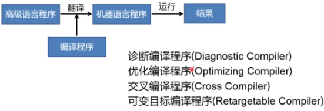

* 本课主要目的是了解程序语言编译程序构造的基本原理和基本实现技术

* 什么是编译程序

  * 翻译程序（Translator）

  > 把某一种语言程序 **（源语言程序）** 等价地转换成另一种语言程序  **（目标语言程序）** 的程序 
  >
  > 

  * 编译程序也是一种翻译程序  通俗一点就是把人话翻译成机器语言 让机器看懂自己想要表达什么

  >它把某一种 **高级语言程序** 等价转换成另一种 **低级语言程序**（such as 汇编语言或机器语言程序）的程序
  >
  >**工作原理**：(会产生可执行的目标代码)
  >
  >

* 什么是解释程序

  * 解释程序也是一种翻译程序  它把源语言写的源程序作为输入 但不产生目标程序，而是边解释边执行

  >**工作原理**:（不产生目标代码）
  >
  >

**区分**：

1. **编译是将源程序翻译成可执行的目标代码；解释程序不产生目标代码**。
2. 解释程序可跨平台使用；编译程序跨平台性不好。 
3. 解释程序可以随时修改，立刻生效；编译程序不行。

**两种类型语言优缺点：**

* 编译型语言
  * 优点：运行速度快，代码效率高，编译后的程序不可修改，保密性较好。
  * 缺点：代码需要经过编译方可运行，可移植性差，只能在兼容的操作系统上运行 。

* 解释型语言
  * 优点：可移植性较好，只要有解释环境，可在不同的操作系统上运行。
  * 缺点：运行需要解释环境，运行起来比编译的要慢，占用资源也要多一些，代码效率低，代码修改后就可运行，不需要编译过程。　　